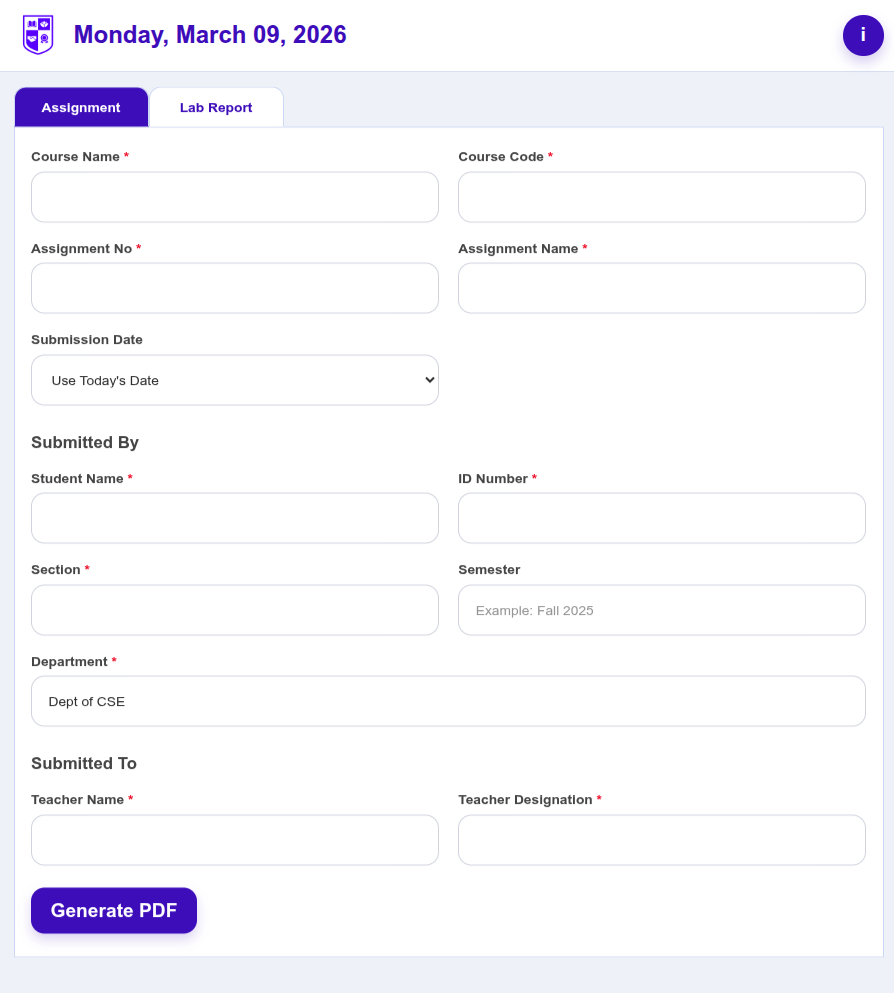
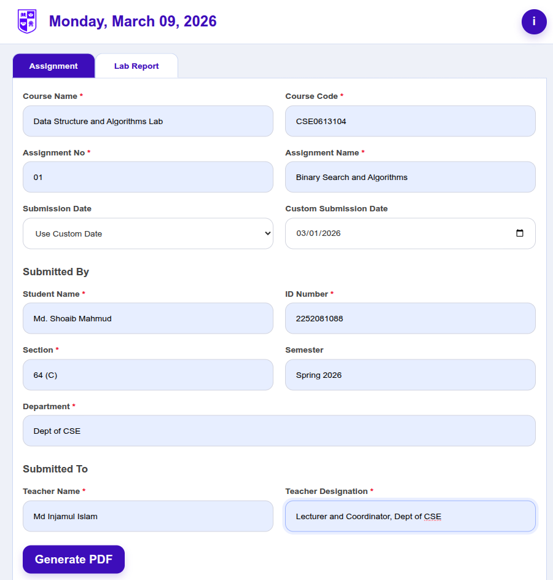
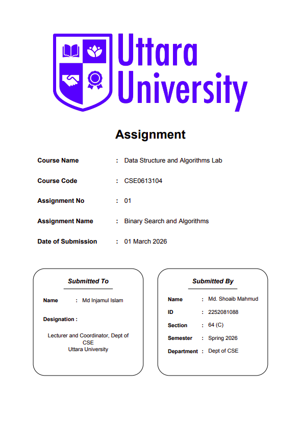
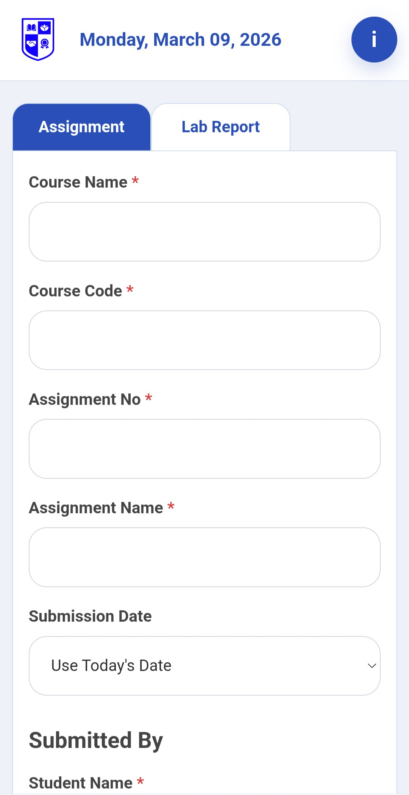

# Cover Maker UU

Cover Maker UU is a simple web application designed to generate assignment and lab report cover pages for Uttara University students.

The main idea of this project is to remove the hassle of manually creating cover pages in Word or other document editors. Students can simply fill in the required fields and download a properly formatted PDF cover page instantly.

---

## Live Website

You can access the project here:

https://covermaker.yzz.me

Clicking the link will open the live application.

---

## Features

- Assignment cover page generator
- Lab report cover page generator
- Automatic PDF formatting
- Mobile friendly interface
- University inspired UI design
- Installable web app (PWA)
- Fast and lightweight

---

## How It Works

1. User selects Assignment or Lab Report tab.
2. User fills the required fields in the form.
3. Form data is submitted to the PHP backend.
4. The backend processes the input data.
5. TCPDF library generates the formatted PDF cover page.
6. The generated PDF is automatically displayed and can be downloaded.

---

## Technologies Used

Frontend:
- HTML
- CSS
- JavaScript

Backend:
- PHP

PDF Generation:
- TCPDF Library

Deployment:
- Shared Hosting

---

## Screenshots

### Homepage

### Form Interface

### Generated PDF

### Mobile View

---

## Developer

Md Shoaib Mahmud  
Department of Computer Science and Engineering  
Uttara University

---

## Project Purpose

This project was developed as a personal learning project to practice:

- PHP based backend development
- Dynamic PDF generation
- Responsive UI design
- Progressive Web App concepts
- Real world deployment

The goal was to build something practical that could actually be used by students.
